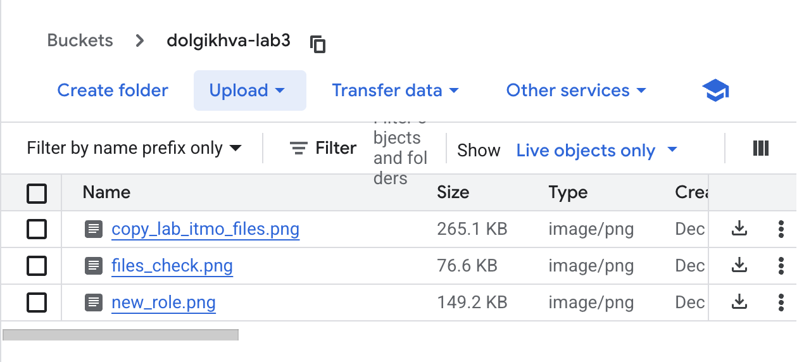
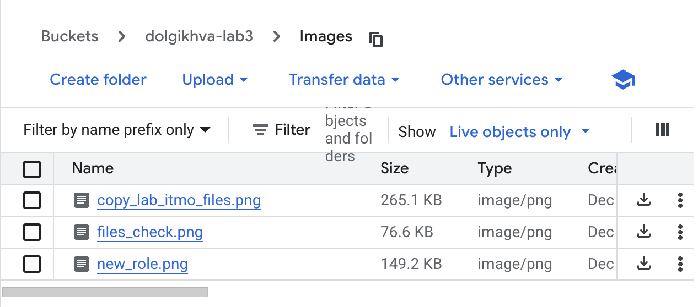
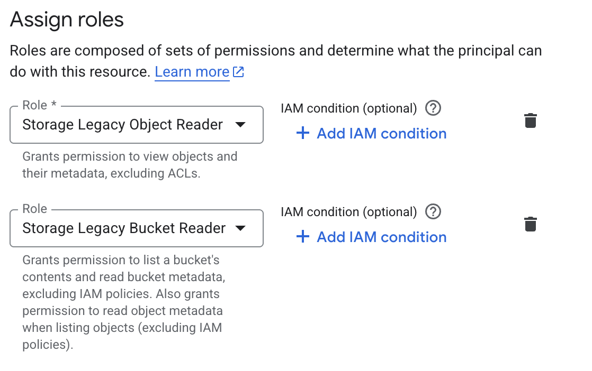
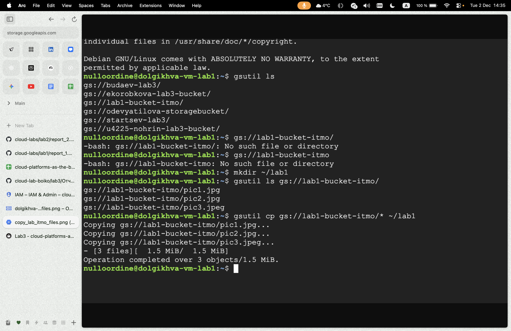

University: [ITMO University](https://itmo.ru/ru/)

Faculty: [FTMI](https://ftmi.itmo.ru)

Course: [Cloud platforms as the basis of technology entrepreneurship](https://itmo-ict-faculty.github.io/cloud-platforms-as-the-basis-of-technology-entrepreneurship/education/labs2023-2024/lab1/lab1/#_2)

Year: 2025/2026

Group: HBM

Lab: Lab3

Date of create: 02.12.2025
Date of finished: 02.12.2025

# Лабораторная работа 3

## Цель работы
Ознакомиться с основными понятиями и принципами работы облачного хранилища, изучить различные модели хранения данных (блочное, файловое и объектное хранилище), познакомиться с основными сервисами и функционалом, предоставляемым облачными хранилищами.

## Ход работы

### 1. Загрузка файлов в Cloud Storage

- Был создан  Cloud Storage bucket - dolgikhva -lab3

- Были загружены изображения в созданный Cloud Storage bucket.

### 2. Создание папки и перенос файловw

- Создана новая папка в бакете - Screenshots
- Загруженные файлы были перенесены в эту папку

### 3. Настройка публичного доступа

- Открыл настройки доступа для бакета, убрал все существующие правила доступа и ограничения 
- Открыл доступ к папке Screenshots в бакете, добавив правило доступа для **allUsers** 

### 4. Получение публичных ссылок

- Нажал на имя файла в списке и перешел по ссылке **Public URL** для каждого файла
- Проверил доступность файлов через публичные ссылки — всё работало корректно

### 5. Завершение работы

- После выполнения всех действий созданный сервис и файлы были удалены 

