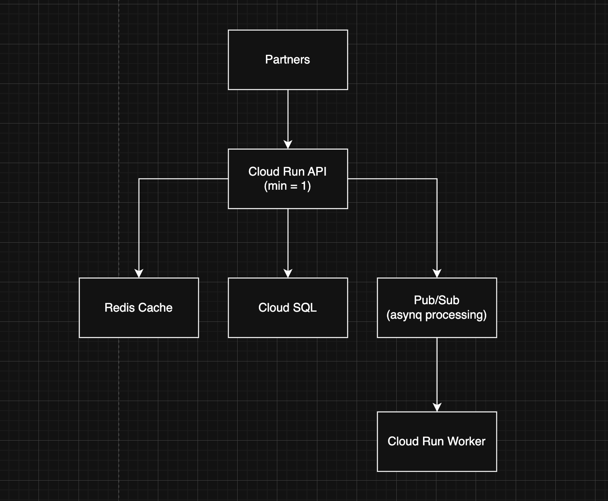
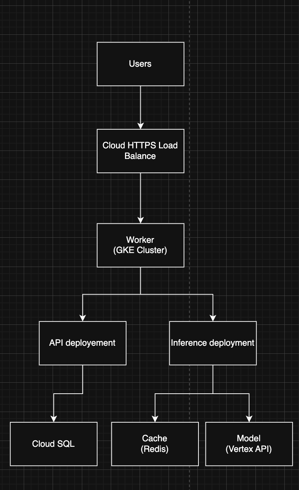

#  **Отчёт по проектированию инфраструктуры сервиса анализа тональности текстов (ИИ)**

## **Описание продукта**

Сервис для анализа тональности текста на основе нейросетевой модели (sentiment analysis) Пользователь отправляет текст → сервис возвращает оценку тональности («позитивная», «негативная», «нейтральная») Система должна быть масштабируемой и обеспечивать разные уровни нагрузки на трёх стадиях:

* начальное MVP состояние,
* тестирование с партнёрами,
* продовое решение

---

## **Состояние 1 - Начальное (MVP, минимальные затраты)**

### **Цели**

* Быстрый запуск
* Минимальное обслуживание
* Минимальные затраты
* Гибкость для обновления модели

### **Выбранные ресурсы (GCP)**

* **Cloud Run** - развертывание API
* **Cloud Storage** - хранение модели
* **Firestore** - хранение истории запросов
* **Cloud Logging** - логи
* **IAM** - минимальная конфигурация доступа

### **Схема инфраструктуры (MVP)**

## **Состояние 2 - Тестирование партнёрами**

### **Цели**

* Стабильность API
* Кэширование быстрых результатов
* Управление доступом партнёров
* Обработка длинных текстов
* Минимальный SLA

### **Выбранные ресурсы**

* **Cloud Run (min instances=1)** - гарантированный отклик
* **Memorystore (Redis)** - кэш
* **Cloud SQL (PostgreSQL)** - метаданные, партнёрские ключи
* **Cloud Pub/Sub** - отложенная обработка
* **Cloud Storage** - хранение моделей
* **Cloud Monitoring** - метрики

### **ASCII-схема инфраструктуры (Partner testing)**

## **Состояние 3 - Продовая архитектура (масштабирование + SLA)**

### **Цели**

* Масштабирование под высокую нагрузку
* Разделение API и inference
* Zero-downtime деплой
* Модели обновляются через Vertex AI
* Много версий модели (A/B тестирование)
* Полная безопасность и мониторинг

### **Выбранные ресурсы**

* **GKE (Kubernetes)** - API + inference + autoscale
* **Vertex AI Endpoint** - хостинг ML моделей
* **Cloud Load Balancer** - HTTPS маршрутизация
* **Cloud SQL (HA mode)** - отказоустойчивость
* **Memorystore** - кэширование
* **Bigtable (optional)** - аналитика
* **Cloud Armor** - защита
* **Cloud Monitoring + Logging**

### **Cхема инфраструктуры (Production)**

## **Экономическая модель (стоимость содержания)**

### **Таблица расходов**

| Ресурс             | Stage 1 (MVP) | Stage 2 (Partners) | Stage 3 (Prod) |
| ------------------ | ------------- | ------------------ | -------------- |
| Cloud Run          | $10           | $70                | -              |
| GKE Cluster        | -             | -                  | $500           |
| Vertex AI Endpoint | -             | -                  | $300–500       |
| Firestore          | $1–5          | -                  | -              |
| Cloud SQL          | -             | $40–70             | $200–300       |
| Memorystore        | -             | $20                | $80            |
| Cloud Storage      | $010          | $1                 | $5             |
| Pub/Sub            | -             | $2                 | $5             |
| Monitoring/Logging | $0.1          | $5                 | $10            |
| Load Balancer      | -             | -                  | $20            |
| **ИТОГО**          | **$10–20**    | **$120–200**       | **$700–1500**  |

---

## **Обоснование выбора ресурсов**

### **Stage 1 (MVP)**

Cloud Run + Firestore - самое дешёвое и гибкое serverless-решение
Не требует DevOps, идеально при низком трафике

### **Stage 2 (Partners)**

Cloud Run с min instances обеспечивает стабильный отклик
SQL + Redis → управление партнёрами и быстрые ответы
Pub/Sub нужен для длинных текстов, без timeouts

### **Stage 3 (Production)**

GKE + Vertex AI - единственные сервисы Google, которые гарантируют масштабирование под тысячи RPS
Разделение API и inference улучшает надёжность
SQL HA + Redis + Armor гарантируют SLA и безопасность

---

## **7 Заключение**

Спроектирована инфраструктура для сервиса анализа тональности в трёх стадиях развития: от дешёвого MVP до масштабируемого продового решения
Предложенная архитектура учитывает:

* рост нагрузки,
* требуемые SLA,
* затраты,
* особенности ML-моделей,
* необходимость A/B тестирования,
* безопасность и мониторинг